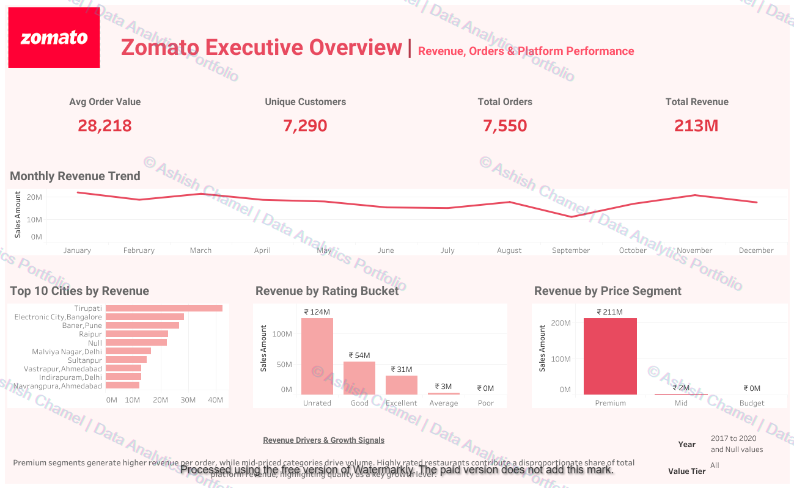
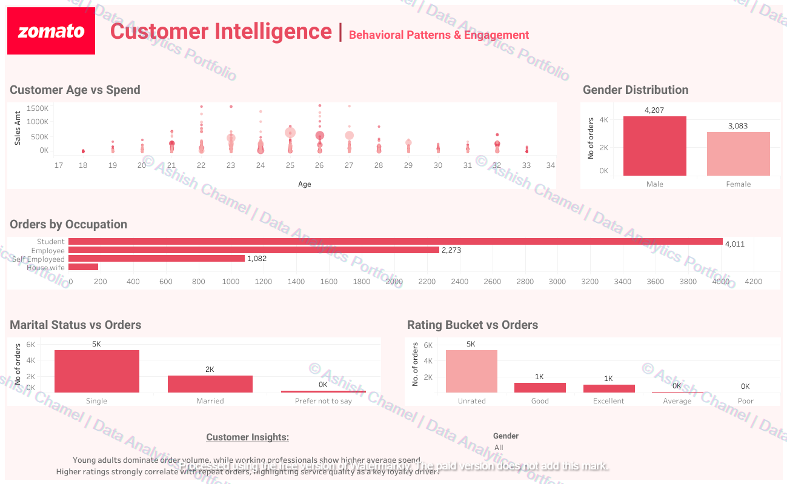
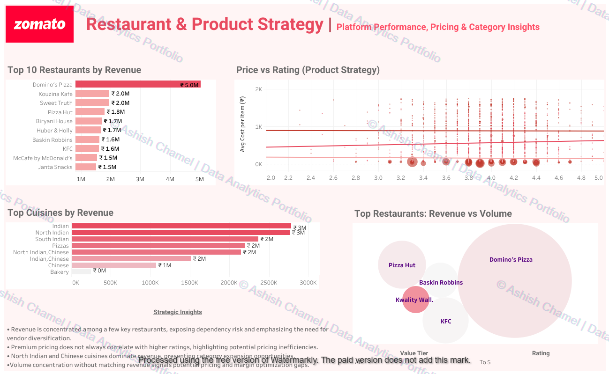

# Zomato Platform Performance, Customer Intelligence & Growth Strategy

An end-to-end analytics case study focused on uncovering revenue drivers, customer behavior patterns, and restaurant performance insights within a food delivery platform ecosystem.

This project demonstrates data cleaning, feature engineering, segmentation analysis, and executive-level dashboard storytelling using Python and Tableau.

---

##  Live Dashboards

Interactive dashboards available on Tableau Public:

 https://public.tableau.com/app/profile/ashish.chamel

---

##  Project Objective

The primary goal of this project was to simulate a real-world product analytics scenario by answering key business questions such as:

- What drives overall platform revenue?
- Which customer segments generate the most value?
- How do ratings impact order volume and revenue?
- Which cuisines and restaurants dominate performance?
- Is pricing aligned with perceived customer value?

---

##  Tools & Technologies

- **Python (Pandas)** — Data cleaning, transformation, and feature engineering  
- **Tableau** — Dashboard development and visual analytics  
- **Excel** — Raw data storage  

---

##  Data Processing & Engineering (Python)

The full data pipeline is implemented in:
src/zomato_analysis.py


### Steps Performed:

1. Loaded multiple datasets (Orders, Users, Restaurants, Food)
2. Removed duplicates and invalid transactions
3. Standardized column names
4. Merged datasets into a unified analytical table
5. Engineered business metrics:
   - Cost per item
   - Rating buckets (Poor / Average / Good / Excellent / Unknown)
   - Price segmentation (Budget / Mid / Premium)
   - Year & Month extraction for trend analysis
6. Exported final dataset for Tableau visualization

Raw datasets and Tableau workbook are intentionally excluded.

---

#  Dashboard Overview

---

## 1️ Executive Overview



**Purpose:** High-level performance snapshot for decision-makers.

**Key Metrics:**
- Total Revenue
- Total Orders
- Unique Customers
- Average Order Value
- Monthly Revenue Trends
- Revenue by City
- Revenue by Price Segment
- Revenue by Rating Bucket

**Insights:**
- Premium price segment contributes majority of revenue
- Revenue fluctuates seasonally
- Highly rated restaurants drive disproportionate revenue

---

## 2️ Customer Intelligence Dashboard



**Purpose:** Understand customer demographics and behavior.

**Analysis Includes:**
- Age vs Spend patterns
- Gender-based order distribution
- Orders by occupation
- Marital status segmentation
- Rating bucket vs repeat order trends

**Insights:**
- Young adults dominate order volume
- Students are the most active segment
- Higher ratings correlate with stronger repeat behavior

---

## 3️ Restaurant & Product Strategy Dashboard



**Purpose:** Identify growth opportunities and pricing optimization.

**Analysis Includes:**
- Top restaurants by revenue
- Cuisine performance analysis
- Rating vs price correlation
- Revenue vs volume concentration

**Insights:**
- Revenue concentrated among top-performing restaurants
- Premium pricing does not always guarantee higher ratings
- North Indian and Chinese cuisines dominate overall revenue

---

#  Strategic Recommendations

1. Expand high-performing cuisine categories into new markets.
2. Strengthen loyalty programs targeting student segments.
3. Promote high-rated restaurants for retention growth.
4. Support mid-tier restaurants with pricing and visibility optimization.
5. Optimize premium pricing based on rating elasticity insights.

---

#  Repository Structure
```
zomato-data-analysis/
│
├── README.md
├── LICENSE
│
├── src/
│ └── zomato_analysis.py
│
└── dashboards/
├── executive_overview.png
├── customer_intelligence.png
└── restaurant_strategy.png
```

---

##  Notes

- Dataset and Tableau workbook are excluded to protect original work.
- Dashboards are publicly accessible via Tableau Public.
- Screenshots include watermark for ownership.

---

##  Author

Ashish Chamel  
Data Analytics Portfolio  

 Tableau Public:  
https://public.tableau.com/app/profile/ashish.chamel  

 LinkedIn:  
https://www.linkedin.com/in/ashish-chamel  

---

© Ashish Chamel | Data Analytics Portfolio
